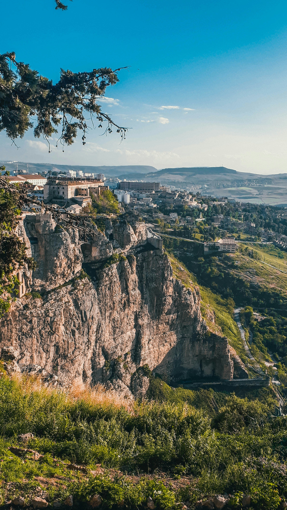

# 🌍 Welcome to Algeria

#### 🎥 Video Demo: [Watch Here](https://youtu.be/dEyxkOynraAsssss)
#### 📂 Project Repository: [GitHub Link](https://github.com/Abdelkader-maizi/cs50-final-project.git)

---

## 🔹 Description
**Welcome to Algeria** is a fully responsive website that highlights the beauty, culture, and history of Algeria.
It introduces users to the country through visually appealing sections, interactive cards, and a dynamic photo gallery.
The website is designed for both desktop and mobile users, providing smooth navigation and engaging animations.

---

## 🏆 Features
- **Hero Section**: Eye-catching introduction with background image and call-to-action button.
- **Responsive Navigation Bar**: Sticky navbar with smooth scrolling to sections.
- **Introduction Section**: Overview of Algeria’s history, culture, and landscapes.
- **Info Cards**: Interactive cards presenting History, Culture, Geography, Cuisine, and Tourism.
- **Discover Section**: External links for further exploration (Wikipedia, Algeria.com, Lonely Planet).
- **Photo Gallery**: Grid layout with modal popups for enlarged images and descriptions.
- **Footer with Social Links**: Facebook, Instagram, and GitHub profiles.
- **Animations**: Smooth scroll-based fade-in and zoom effects using [AOS.js](https://michalsnik.github.io/aos/).
- **Accessibility & SEO**: Descriptive `alt` attributes for images and semantic HTML structure.
- **Responsive Design**: Optimized for mobile, tablet, and desktop devices.

---

## 🛠 Technologies Used

- **HTML5 & CSS3** – Structure and styling
- **Bootstrap 5** – Responsive design, grid, modals, navbar
- **Bootstrap Icons** – Icons for footer and UI elements
- **JavaScript (Bootstrap bundle)** – Interactivity and modal functionality
- **AOS.js** – Scroll-based animations

---

## 📸 Screenshots
| Hero Section | Info Cards | Photo Gallery |
|-------------|------------|---------------|
|  |  |  |

---

## 🚀 How to Run
1. Clone or download the repository from [GitHub](https://github.com/Abdelkader-maizi/cs50-final-project.git).
2. Ensure the `static/` folder (images and icons) is in the same directory as `index.html`.
3. Open `index.html` in any modern web browser (Chrome, Firefox, Edge).

---

## 🔮 Future Improvements
- Add a **blog section** with news and articles about Algeria.
- Implement a **contact form** with backend support.
- Add **multilingual support** (Arabic, French, English).
- Enhance gallery with **image sliders and video content**.
- Optimize images and performance for faster loading.

---

## 👤 Author
Developed by **Abdelkader Maizi**
- 🌐 [GitHub](https://github.com/Abdelkader-maizi)
- 📸 [Instagram](https://www.instagram.com/abdou._.maizi/)
- 📘 [Facebook](https://www.facebook.com/abdelkader.maizi.2000000000005)

---

## 🌟 License
This project is licensed under the MIT License. See the [LICENSE](LICENSE) file for details.
