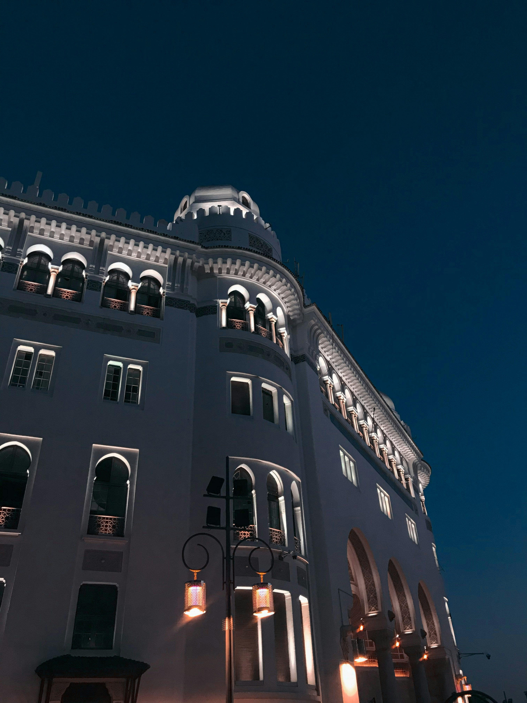
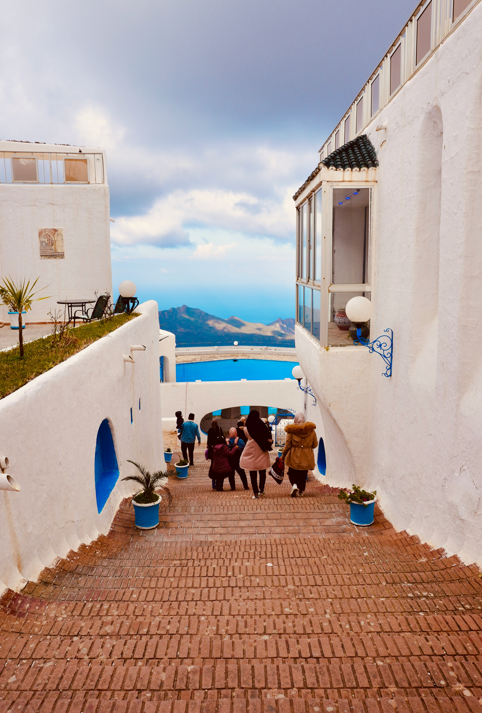

# 🌍 Welcome to Algeria

#### 🎥 Video Demo: [Watch Here](https://youtu.be/dEyxkOynraAsssss)  
#### 📂 Project Repository: [GitHub Link](https://github.com/Abdelkader-maizi/cs50-final-project.git)  

---

## 🔹 Description
**Welcome to Algeria** is a fully responsive website that highlights the beauty, culture, and history of Algeria.  
It introduces users to the country through visually appealing sections, interactive cards, and a dynamic photo gallery.  

---

## 🏆 Features
- **Hero Section** with background image and call-to-action button.  
- **Responsive Navigation Bar** with smooth scrolling links.  
- **Introduction Section** overviewing Algeria’s history, culture, and landscapes.  
- **Info Cards** for History, Culture, Geography, Cuisine, and Tourism.  
- **Discover Section** with external links (Wikipedia, Algeria.com, Lonely Planet).  
- **Photo Gallery** with modal popups and descriptions.  
- **Footer with Social Links**: Facebook, Instagram, GitHub.  
- **Animations** with AOS.js.  
- **Responsive Design** optimized for mobile, tablet, and desktop.  

---

## 🛠 Technologies Used


---

## 📸 Gallery Preview

| Image | Description |
|-------|-------------|
|  | Sahara Desert – Experience the endless sands of southern Algeria. |
|  | Algiers City – The capital city with historic Casbah and Mediterranean views. |
|  | Mediterranean Coast – Stunning beaches along northern Algeria. |
|  | Ancient Ruins – Explore Roman and historical archaeological sites. |
|  | Casbah Algiers – UNESCO World Heritage site in the old city. |
|  | Sahara Adventure – Desert landscapes and traditional culture. |
|  | Algerian Market – Colorful souks and local crafts. |
|  | Mediterranean Sunset – Breathtaking coastal sunsets. |
|  | Berber Village – Traditional Berber architecture and lifestyle. |
|  | Algerian Festival – Cultural celebrations and music. |
|  | Atlas Mountains – Majestic mountain ranges and scenery. |

> **Tip:** Click on each image in the live website to view a larger modal with description.  

---

## 🚀 How to Run
1. Clone or download the repository:  
   ```bash
   git clone https://github.com/Abdelkader-maizi/cs50-final-project.git
